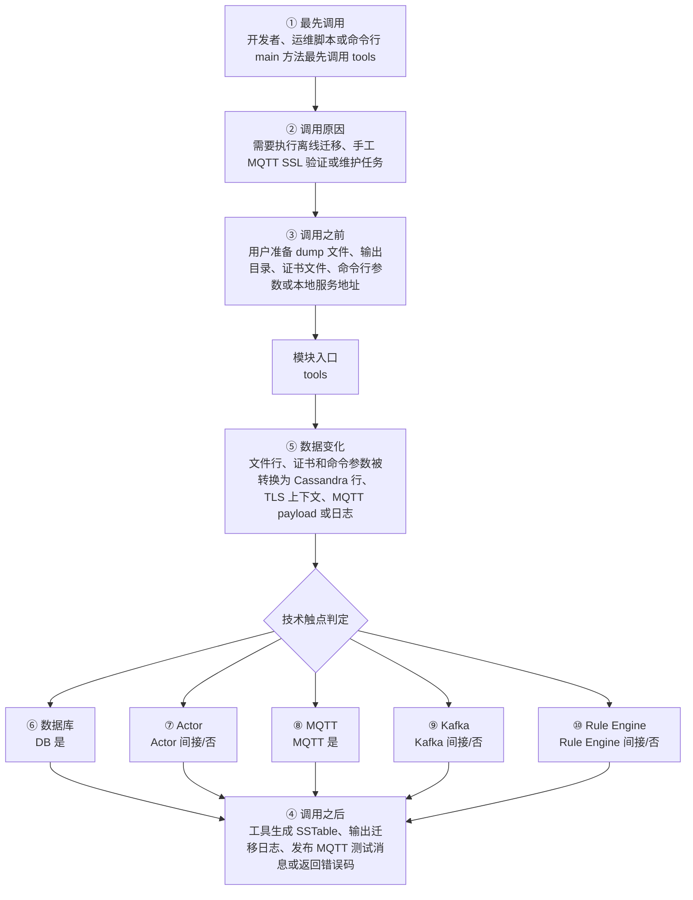

# Thingsboard Server Tools 模块调用链分析

> 生成范围：`tools`  
> Maven artifact：`tools`  
> packaging：`jar`  
> 分析方式：静态扫描 POM、Java 注解、入口方法、关键技术触点和类关系；不是运行时 trace。

## 完整流程图

## 十项调用链问题

| 问题 | 模块级结论 |
| --- | --- |
| ① 谁最先调用这里？ | 开发者、运维脚本或命令行 main 方法最先调用 tools |
| ② 为什么会调用？ | 需要执行离线迁移、手工 MQTT SSL 验证或维护任务 |
| ③ 调用之前发生了什么？ | 用户准备 dump 文件、输出目录、证书文件、命令行参数或本地服务地址 |
| ④ 调用之后发生什么？ | 工具生成 SSTable、输出迁移日志、发布 MQTT 测试消息或返回错误码 |
| ⑤ 数据如何变化？ | 文件行、证书和命令参数被转换为 Cassandra 行、TLS 上下文、MQTT payload 或日志 |
| ⑥ 对数据库进行了哪些操作？ | 是，发现直接操作证据；直接操作证据：发现 Repository/JPA/Cassandra/JDBC/SSTable 或 DAO 模块操作模式。关键词触点 2 处仅作为辅助线索。 |
| ⑦ 是否发送 Actor 消息？ | 否，未发现直接操作证据；未发现直接源码证据；若发生，通常在依赖的下游模块中完成。 |
| ⑧ 是否发送 MQTT 消息？ | 是，发现直接操作证据；直接操作证据：发现 MQTT client/handler/publish/subscribe/writeAndFlush 等操作模式。关键词触点 52 处仅作为辅助线索。 |
| ⑨ 是否写入 Kafka？ | 否，未发现直接操作证据；未发现直接源码证据；若发生，通常在依赖的下游模块中完成。 |
| ⑩ 是否写入 Rule Engine？ | 否，未发现直接操作证据；未发现直接源码证据；若发生，通常在依赖的下游模块中完成。 |

## 入口证据

- 命令行或进程启动入口: `tools/src/main/java/org/thingsboard/client/tools/MqttSslClient.java`
- 命令行或进程启动入口: `tools/src/main/java/org/thingsboard/client/tools/migrator/MigratorTool.java`

## 静态关键词统计（不等同于实际发送/写入）

- database: 2 处静态触点；直接操作证据：发现 Repository/JPA/Cassandra/JDBC/SSTable 或 DAO 模块操作模式。关键词触点 2 处仅作为辅助线索。
- actor: 0 处静态触点；未发现直接源码证据；若发生，通常在依赖的下游模块中完成。
- mqtt: 52 处静态触点；直接操作证据：发现 MQTT client/handler/publish/subscribe/writeAndFlush 等操作模式。关键词触点 52 处仅作为辅助线索。
- kafka: 0 处静态触点；未发现直接源码证据；若发生，通常在依赖的下游模块中完成。
- rule_engine: 0 处静态触点；未发现直接源码证据；若发生，通常在依赖的下游模块中完成。
- cache: 0 处静态触点；未发现直接源码证据；若发生，通常在依赖的下游模块中完成。
- queue: 0 处静态触点；未发现直接源码证据；若发生，通常在依赖的下游模块中完成。
- rest: 0 处静态触点；未发现直接源码证据；若发生，通常在依赖的下游模块中完成。
- websocket: 5 处静态触点；直接操作证据：发现静态关键词触点。关键词触点 5 处仅作为辅助线索。
- transport: 0 处静态触点；未发现直接源码证据；若发生，通常在依赖的下游模块中完成。

## 调用前后数据流

1. 调用前：用户准备 dump 文件、输出目录、证书文件、命令行参数或本地服务地址
2. 模块入口：`tools` 通过入口类、依赖 API、构建聚合或子模块暴露能力。
3. 模块内转换：文件行、证书和命令参数被转换为 Cassandra 行、TLS 上下文、MQTT payload 或日志
4. 调用后：工具生成 SSTable、输出迁移日志、发布 MQTT 测试消息或返回错误码
5. 数据库/Actor/MQTT/Kafka/Rule Engine 这些动作若没有直接触点，通常发生在依赖的 `application`、`dao`、`common/queue`、`common/transport` 或 `rule-engine` 模块中。

## 子模块与依赖

### 子模块

- 无子模块。

### 主要依赖

- `org.thingsboard.common:data`
- `org.springframework.boot:spring-boot-starter-web`
- `org.eclipse.paho:org.eclipse.paho.client.mqttv3`
- `com.google.guava:guava`
- `org.apache.cassandra:cassandra-all`
- `org.apache.cassandra:cassandra-thrift`
- `commons-io:commons-io`

## 关键类型样本

- `MqttSslClient` (class, `tools/src/main/java/org/thingsboard/client/tools/MqttSslClient.java`)
- `DictionaryParser` (class, `tools/src/main/java/org/thingsboard/client/tools/migrator/DictionaryParser.java`)
- `MigratorTool` (class, `tools/src/main/java/org/thingsboard/client/tools/migrator/MigratorTool.java`)
- `PgCaMigrator` (class, `tools/src/main/java/org/thingsboard/client/tools/migrator/PgCaMigrator.java`)
- `RelatedEntitiesParser` (class, `tools/src/main/java/org/thingsboard/client/tools/migrator/RelatedEntitiesParser.java`)
- `WriterBuilder` (class, `tools/src/main/java/org/thingsboard/client/tools/migrator/WriterBuilder.java`)

## 阅读建议

- 先看“完整流程图”确认模块在全链路中的位置。
- 再看入口证据判断调用来源是 HTTP、MQTT/Transport、Actor、Kafka、Rule Engine、DAO、测试还是构建聚合。
- 最后用触点统计区分直接行为和下游间接行为，避免把依赖模块的数据库写入误认为本模块直接写入。
